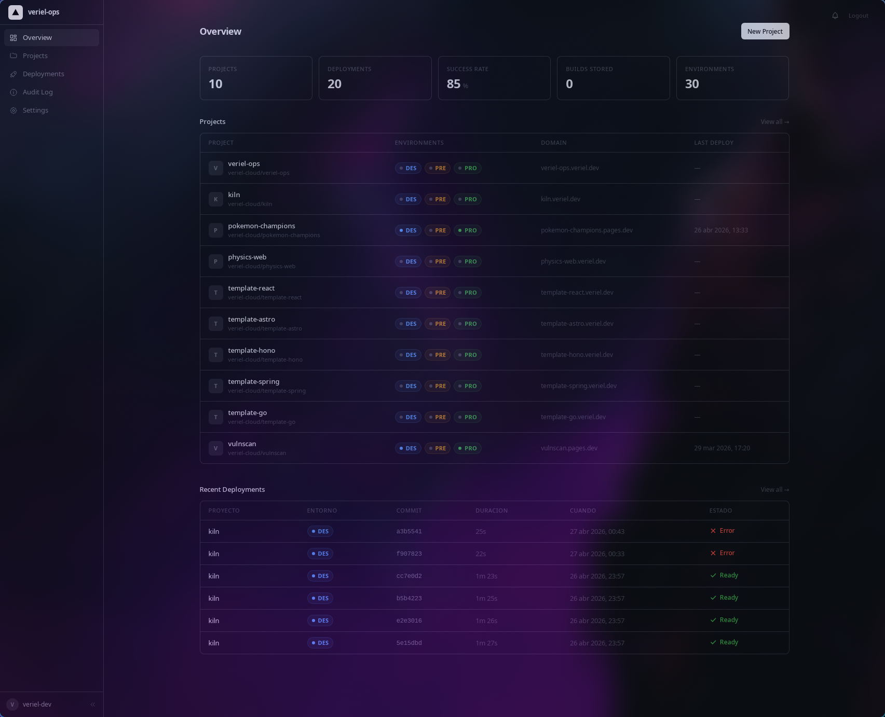
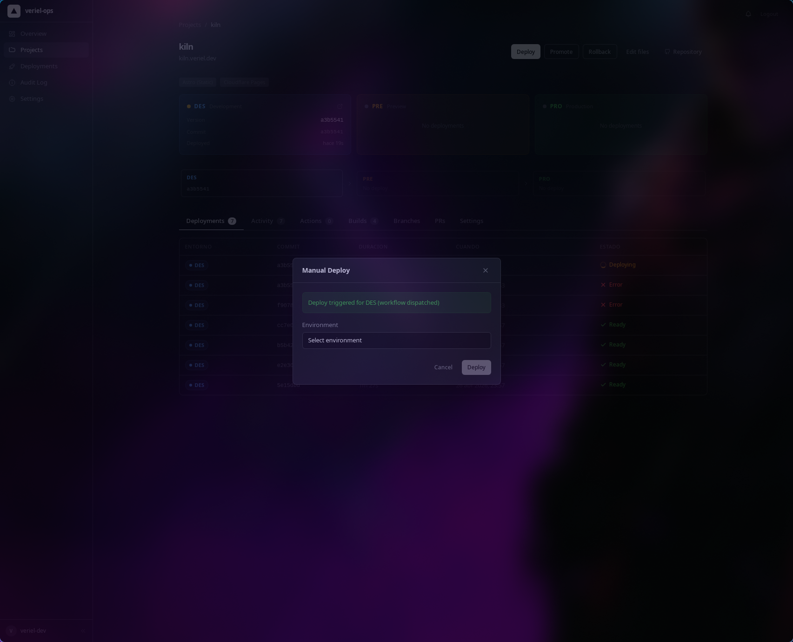

# veriel-ops

> Plataforma de DevOps para gestionar despliegues, rollbacks, dominios y monitorización de proyectos web — todo desde un dashboard, sin tocar la consola de Cloudflare ni GitHub Actions.

Pensado como un panel unificado tipo Vercel para infra propia: orquesta GitHub, Cloudflare Pages/Workers, R2, DNS y SQLite local detrás de una API en Bun + Hono y un dashboard en React 19 que también funciona como app de escritorio (Tauri 2).

[](./LICENSE)
[](https://bun.sh)
[](https://www.typescriptlang.org/)
[](https://biomejs.dev/)

---

## Qué hace

- **Despliegues con un click** a tres entornos (DES / PRE / PRO) con tracking en tiempo real vía SSE
- **Rollback instantáneo** desde artefactos versionados en R2
- **Promote release → main** con PR automático y guard de cobertura ≥ 80 %
- **Onboarding de proyectos** — crea repo, configura DNS, Pages y secrets en un único pipeline
- **Dashboard reactivo** con TanStack Query (sin Redux/Zustand) + tema claro/oscuro/5 variantes
- **App de escritorio** nativa multi-plataforma con Tauri 2

## Stack

| Capa | Tecnología |
|---|---|
| Runtime | **Bun** + TypeScript estricto |
| API | **Hono** sobre Bun (servidor persistente, SSE) |
| Dashboard | **Vite 6** + **React 19** + **TanStack Query v5** + React Router 7 |
| Escritorio | **Tauri 2** (Rust + WebKitGTK) |
| Estilos | **Tailwind CSS 4** + CSS custom properties |
| DB | **Bun SQLite** (WAL, prepared statements, in-memory tests) |
| Linter | **Biome 2** (formatter + linter unificado) |
| Tests | **Vitest** + Testing Library + happy-dom |
| Infra | Cloudflare Pages + Workers + R2 + DNS API + GitHub Actions |
| Git hooks | Lefthook (pre-commit: `biome check --write`) |

## Cómo funciona

```
┌──────────────┐    ┌──────────────┐    ┌──────────────┐
│   develop    │ →  │  release/*   │ →  │     main     │
└──────────────┘    └──────────────┘    └──────────────┘
       ↓                    ↓                    ↓
     [DES]               [PRE]                [PRO]
   sin gate          cob ≥ 80 %           cob ≥ 80 %
```

El servidor escucha webhooks de GitHub, dispara workflows reutilizables, recibe deploy-tracking via SSE y persiste todo en SQLite. El dashboard consume la API REST y un stream SSE para mostrar progreso en vivo de pipelines, jobs y steps.

| Entorno | Branch | Dominio (configurable vía `BASE_DOMAIN`) |
|---|---|---|
| DES | `develop` | `<proyecto>-des.<base>` |
| PRE | `release/*` | `<proyecto>-pre.<base>` |
| PRO | `main` | `<proyecto>.<base>` |

Los artefactos se guardan en R2 con la ruta `{project}/{env}/{version}_{commitSha}.tar.gz` para permitir rollback en cualquier momento.

## Arquitectura

- 🗺️ Diagrama interactivo: [`docs/architecture-diagram.html`](./docs/architecture-diagram.html)
- 🔐 Flujo de autenticación: [`docs/diagrams/auth-flow.svg`](./docs/diagrams/auth-flow.svg)
- 💾 Estrategia de caché: [`docs/diagrams/cache-flow.svg`](./docs/diagrams/cache-flow.svg)
- 🌐 DNS routing: [`docs/diagrams/dns-routing.svg`](./docs/diagrams/dns-routing.svg)
- 📡 Server-Sent Events: [`docs/guides/sse-guide.md`](./docs/guides/sse-guide.md)

```
dashboard/          React SPA (web + Tauri shell)
  src/components/   Reutilizables (ui/ para primitivos)
  src/hooks/        queries.ts, mutations.ts, useDeploysStream.ts
  src/pages/        Una vista por ruta
  src/lib/          api.ts, query-client.ts, contexts

server/             API REST + SSE + webhooks
  src/routes/       Un archivo por recurso
  src/services/     Lógica de negocio como factories
  src/middleware/   auth, logger
  src/lib/          cache, db, logger, migrations

packages/shared/    Tipos y constantes compartidas
```

## Requisitos

- **Bun** ≥ 1.1 — [bun.sh](https://bun.sh)
- **pnpm** ≥ 10 — `corepack enable && corepack prepare pnpm@latest --activate`
- **Rust** + **Cargo** (solo para la app Tauri) — [rustup.rs](https://rustup.rs)
- Dependencias de sistema para Tauri/WebKitGTK (solo Linux):
  ```bash
  # Arch / CachyOS
  sudo pacman -S webkit2gtk-4.1 libappindicator-gtk3 librsvg pango
  # Ubuntu / Debian
  sudo apt install libwebkit2gtk-4.1-dev libappindicator3-dev librsvg2-dev
  ```

## Setup

```bash
# 1. Clonar e instalar
git clone git@github.com:<your-org>/veriel-ops.git
cd veriel-ops
pnpm install

# 2. Configurar variables de entorno
cp .env.example server/.dev.vars
cp dashboard/.env.example dashboard/.env
# Editar ambos con tus tokens (GitHub PAT, Cloudflare API token, R2 keys, etc.)

# 3. Arrancar dashboard (:5173) + server (:3001) en paralelo
pnpm dev
```

La base de datos SQLite se crea automáticamente en `server/data/` al arrancar el servidor.

## Comandos

```bash
pnpm dev              # Dashboard + server en paralelo
pnpm dev:dashboard    # Solo frontend
pnpm dev:server       # Solo API
pnpm build            # Build de producción
pnpm lint             # Biome check + fix
pnpm test             # Vitest en todo el monorepo
pnpm typecheck        # tsc --noEmit
pnpm tauri:dev        # App de escritorio en desarrollo
pnpm tauri:build      # Build nativo de escritorio
```

## Capturas

<p align="center">
  
  
</p>

## Notas

- Workflows de CI/CD reutilizables fuera del repo (caller pattern)
- En Hyprland (Wayland), Tauri necesita forzar X11: el proyecto ya configura `GDK_BACKEND=x11` en `src-tauri/src/main.rs`
- Cobertura mínima de tests: 80 % (obligatoria para PRE y PRO)
- API Postman collection: [`docs/veriel-ops-api.postman_collection.json`](./docs/veriel-ops-api.postman_collection.json)
- Arquitectura y convenciones detalladas en [`CLAUDE.md`](./CLAUDE.md)

## Licencia

[MIT](./LICENSE) © 2026 veriel-dev
